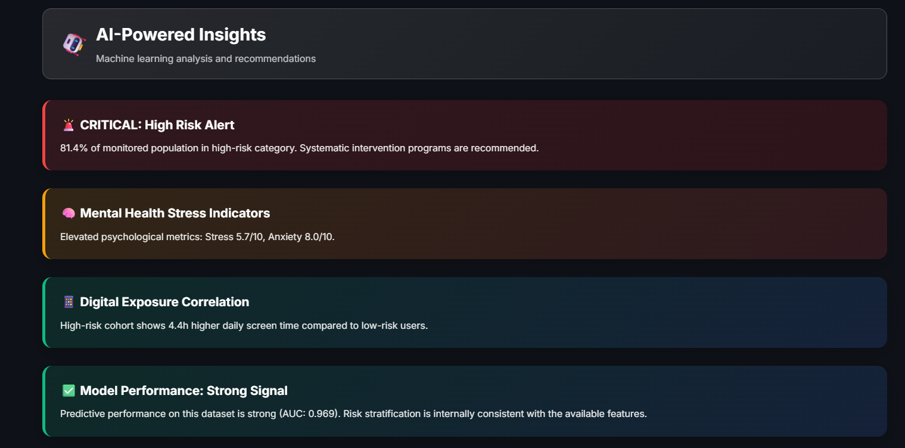
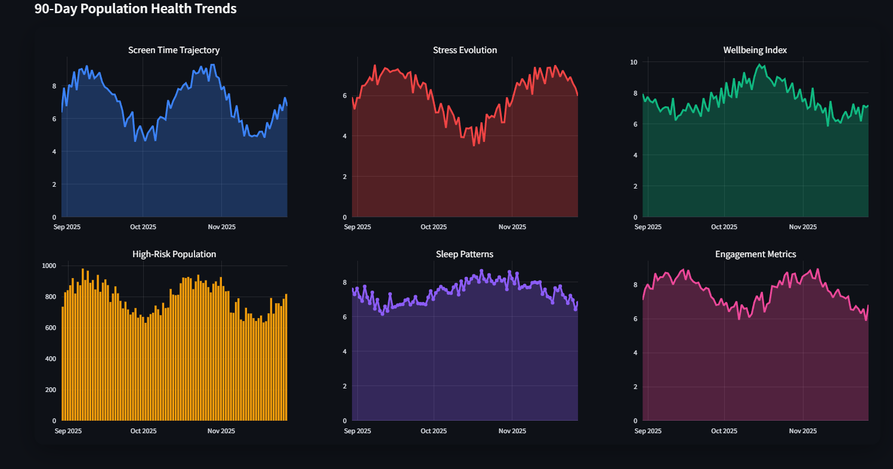
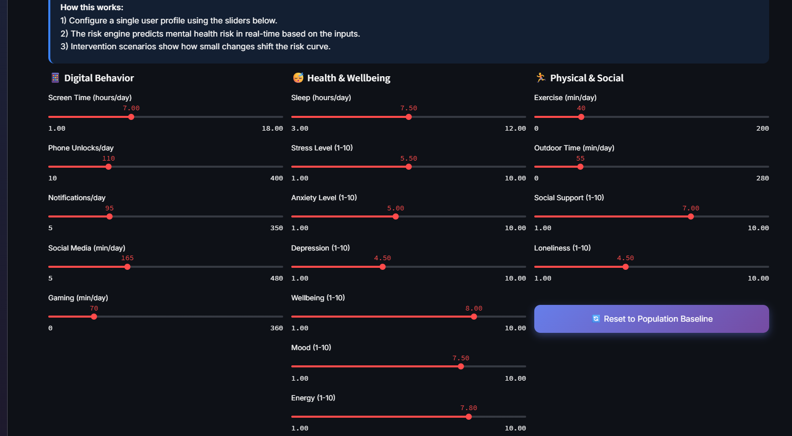
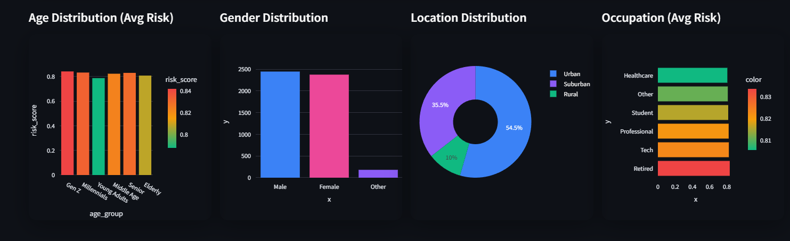
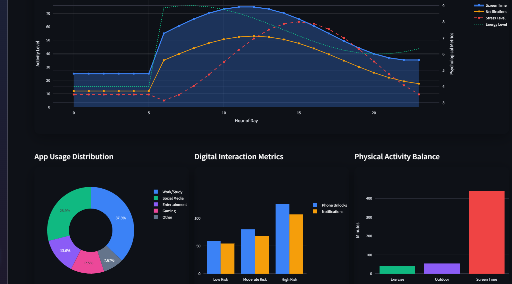
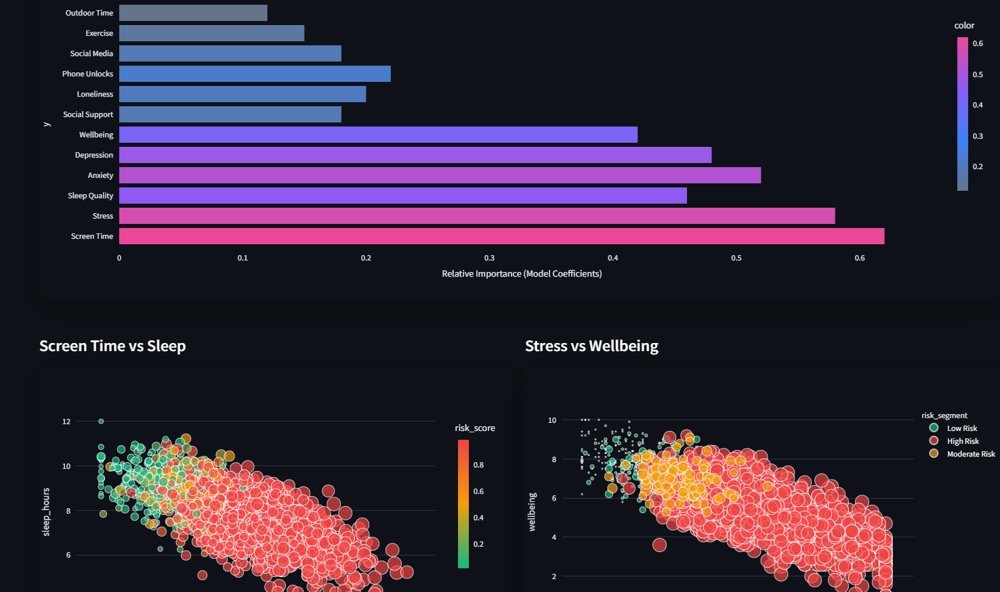
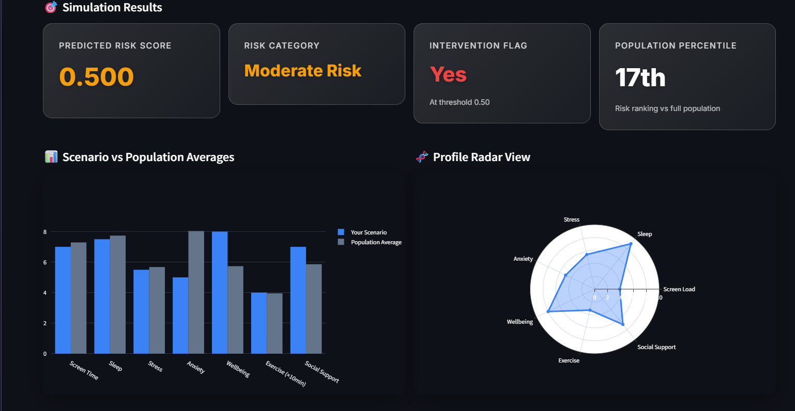

# 🌐 Digital Habits and Mental Health  
### Exploring the Impact of Screen Time and Digital Behavior on Psychological Wellbeing 🤖  

A complete data science project examining how **digital lifestyles** influence **mental health** outcomes — including anxiety, depression, stress, happiness, focus, and productivity.  
Includes a tabular dataset of **3,500 synthetic participant records** with **24 research-inspired features**, plus a reproducible notebook for **EDA, feature engineering, modeling, and explainability**.

---

## 🔎 Important Note on Scoring

Psychological and behavioral indicators  
(e.g., `anxiety_score`, `depression_score`, `stress_level`, `happiness_score`, `focus_score`, `productivity_score`, `digital_dependence_score`)  
are generated as **continuous synthetic scores modeled on a broad 0–100 range**, **not** fixed **0–10 Likert items**.

This provides richer variance and makes the dataset more suitable for ML modeling and behavioral analytics.

---

## 🧩 Project Overview

| Component | Description |
|:--|:--|
| **Dataset** | 24 variables covering demographics, digital activity, and mental health indicators. |
| **Notebook** | Full ML pipeline (EDA → Feature Engineering → Modeling → Explainability). |
| **Models** | Logistic Regression · Random Forest · XGBoost (GPU-ready). |
| **Goal** | Predict high mental-health risk from behavioral and psychological patterns. |

---

## 📊 Dataset Summary

| Metric | Value |
|:--|:--|
| Rows | **3,500** |
| Columns | **24** |
| Target | **high_risk_flag** |
| Type | Tabular (CSV) |

---

## 🧠 Feature Groups

### 🧬 Demographics  
Age · Gender · Region · Income Level · Education Level  

### 💻 Digital Behavior  
Daily Screen Time · Phone Unlocks · Notifications · Social Media Hours · Study Time  

### 🧘 Mental Health Indicators  
Anxiety · Depression · Stress · Happiness · Focus · Productivity  

### ⚠️ Risk Indicator  
`high_risk_flag` — a binary label derived via a **multi-factor wellbeing score** combining digital intensity, emotional state, and cognitive balance.

---

## 📘 Target Definition

The target variable **`high_risk_flag`** represents individuals with increased mental-health vulnerability.  
It is defined using a scoring rule that blends:  
- High digital activity (screen time, notifications, unlocks)  
- Elevated stress/anxiety levels  
- Lower happiness/focus scores  

Approximate distribution: **15–20% high-risk**, reflecting prevalence reported in behavioral research.

---

## 📸 Dashboard Preview

### 1️⃣ AI Health Intelligence — Hero Overview

<p align="center">
  
</p>

---

### 2️⃣ AI-Powered Insights Cards

<p align="center">
  
</p>

---

### 3️⃣ Executive Risk Overview

<p align="center">
  
</p>

---

### 4️⃣ 90-Day Population Health Trends

<p align="center">
  
</p>

---

### 5️⃣ Demographic Risk Breakdown

<p align="center">
  
</p>

---

### 6️⃣ Digital Behavior & Activity Balance

<p align="center">
  
</p>

---

### 7️⃣ Model Insights & Correlations

<p align="center">
  
</p>

---

### 8️⃣ Scenario Simulator — Individual Risk Profile

<p align="center">
  
</p>

---

## 🚀 Quick Start

```bash
# Clone
git clone https://github.com/TarekMasryo/digital-habits-mental-health.git
cd digital-habits-mental-health

# (Optional) create venv
python -m venv .venv && source .venv/bin/activate

# Install dependencies
pip install -r requirements.txt

# Run the main notebook
jupyter notebook notebooks/predicting-wellbeing-risk.ipynb
```
